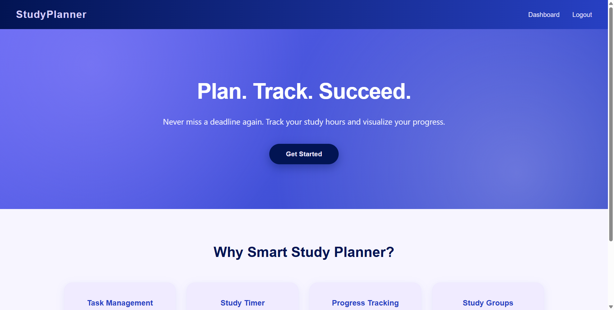
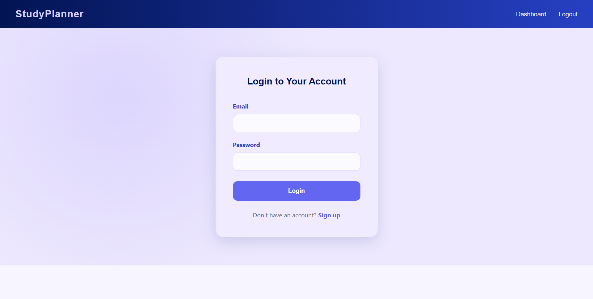
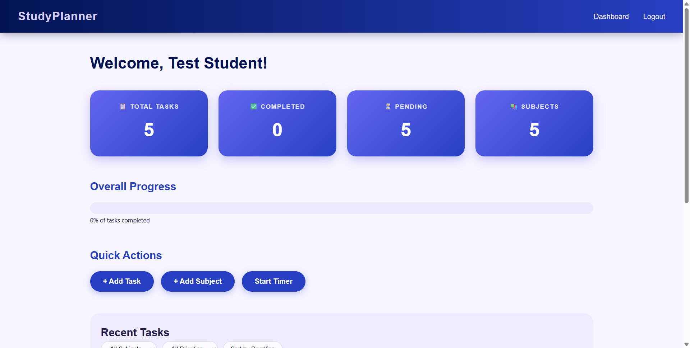

# 📚 Smart Study Planner

> **Plan. Track. Succeed.** A student-focused web app to manage tasks, track study hours with a Pomodoro timer, and never miss a deadline.

---

## 🎓 Academic Context

| Field | Detail |
|-------|--------|
| **Subject** | Web Application Development (BE05000281) |
| **University** | Gujarat Technological University (GTU) |
| **Semester** | 5 |
| **Category** | Professional Elective Course - 02 |
| **PBL Activity** | Complex Problem Solving — develop an SDG-oriented web application |
| **SDG** | SDG 4: Quality Education |
| **PBL Hours** | 15 |
| **Evaluation Criteria** | Innovation and technical depth |

### Course Outcome (CO) Coverage

| Phase | Content | CO Covered |
|-------|---------|------------|
| 1. HTML & CSS Foundation | Responsive pages, flexbox/grid, media queries | CO-2 |
| 2. JavaScript Interactivity | DOM, events, localStorage, fetch, Pomodoro timer | CO-3 |
| 3. Backend Development | Express REST API, MongoDB, JWT, Postman | CO-4 |
| 4. React Frontend | Components, hooks, API integration, CORS | CO-5 |
| 5. Deployment | Hosting, SEO, CAPTCHA, domain | CO-5 |

---

## ✨ Features

- **Task management** — add, edit, complete, delete tasks with subject, priority, and due date
- **Filtering & sorting** — filter by subject/priority, sort by deadline, overdue highlighting
- **Progress tracking** — live stats cards (total / completed / pending / subjects) and progress bar
- **Pomodoro timer** — configurable duration (15/25/45/60 min or custom) with start/pause/reset
- **Authentication** — register & login with JWT, password hashed with bcrypt
- **Responsive design** — mobile-friendly layouts

---

## 🖼️ Screenshots

### Landing Page


### Login


### Dashboard


---

## 🛠️ Tech Stack

| Layer | Technology |
|-------|-----------|
| Frontend | React 19 (Vite), react-router-dom |
| Backend | Node.js, Express.js |
| Database | MongoDB (Mongoose) |
| Auth | JWT, bcryptjs |
| Styling | Custom CSS (indigo theme, Space Grotesk + DM Sans) |

---

## 📁 Project Structure

```
SmartStudyPlanner/
├── client/                 # React frontend (Vite)
│   └── src/
│       ├── components/     # Navbar, TaskCard, TaskForm, Timer, ProgressBar
│       ├── pages/          # Home, Login, Register, Dashboard
│       └── api.js          # fetch helpers with JWT
├── server/                 # Express backend
│   ├── models/             # User, Task, Subject
│   ├── routes/             # auth, tasks, subjects
│   ├── middleware/         # JWT auth
│   └── index.js
├── css/, js/, images/      # Phase 1–2 vanilla version (reference)
├── docs/screenshots/
├── implementation-plan.md  # Milestones, status, risks
└── problem-and-solution.md # Problem statement & SDG 4 alignment
```

---

## 🚀 Running Locally

**Prerequisites:** Node.js, MongoDB running locally (or an Atlas URI).

```bash
# 1. Backend
cd server
npm install
node index.js

# 2. Frontend
cd client
npm install
npm run dev
```

- Frontend: http://localhost:5173
- API: http://localhost:3000/api

**Test account:** `student@test.com` / `123456`

---

## 📡 API Endpoints

| Method | Endpoint | Description |
|--------|----------|-------------|
| POST | /api/auth/register | Register user |
| POST | /api/auth/login | Login user |
| GET | /api/auth/me | Get current user (JWT) |
| GET | /api/tasks | List tasks |
| POST | /api/tasks | Create task |
| PUT | /api/tasks/:id | Update task (whitelisted fields) |
| DELETE | /api/tasks/:id | Delete task |
| GET | /api/subjects | List subjects |
| POST | /api/subjects | Add subject |

---

## 📋 Progress Tracking

| Phase | Status |
|-------|--------|
| 1. HTML & CSS Foundation | ✅ Done |
| 2. JavaScript Interactivity | ✅ Done |
| 3. Backend Development | ✅ Done |
| 4. React Frontend | ✅ Done |
| 5. Deployment | ✅ Done |

---

## 🌐 Live Deployment

- **Frontend (Vercel):** https://smart-study-planner-pi-gules.vercel.app
- **Backend API (Render):** https://smartstudyplanner-api.onrender.com
- **Database:** MongoDB Atlas (free cluster)

---

## 📄 License

This project is for educational purposes under the GTU WAD course.
